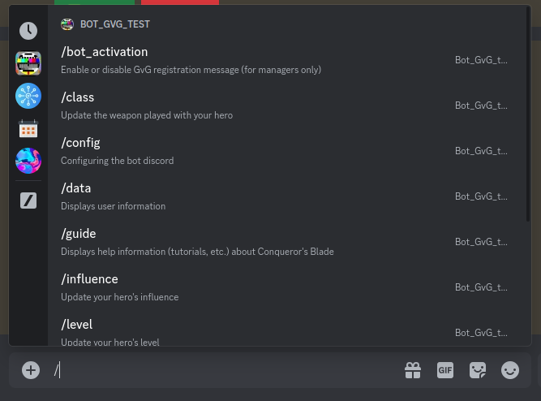
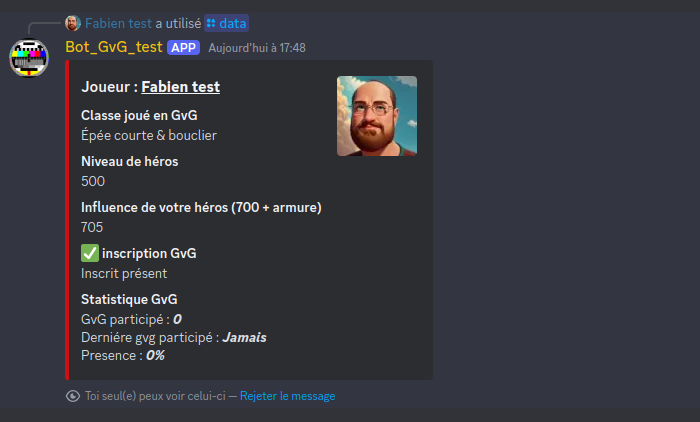
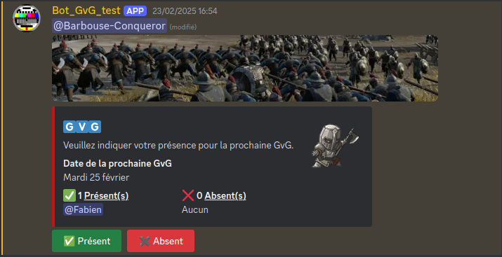
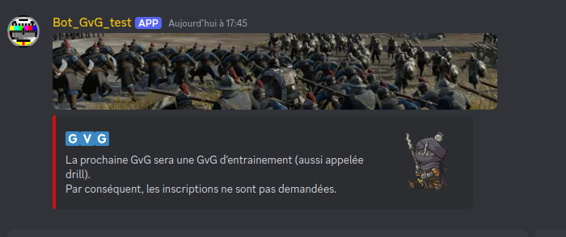
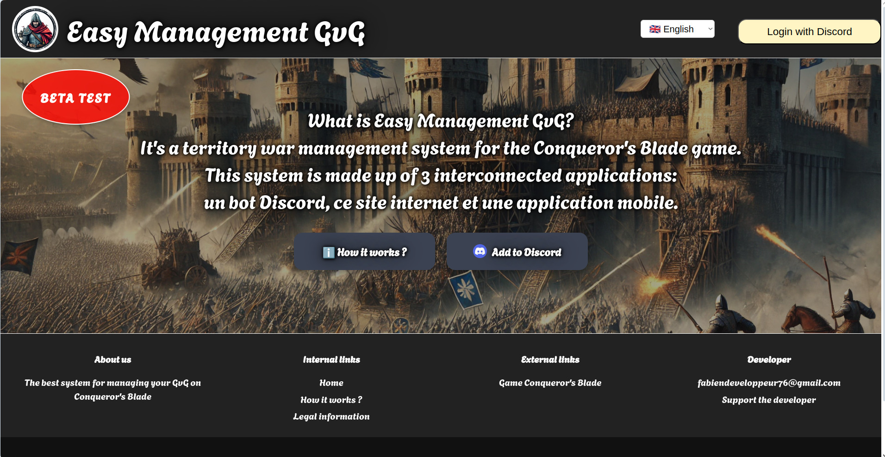
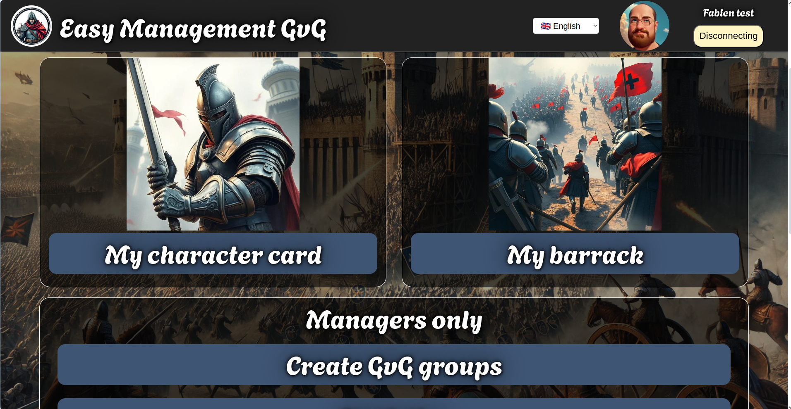
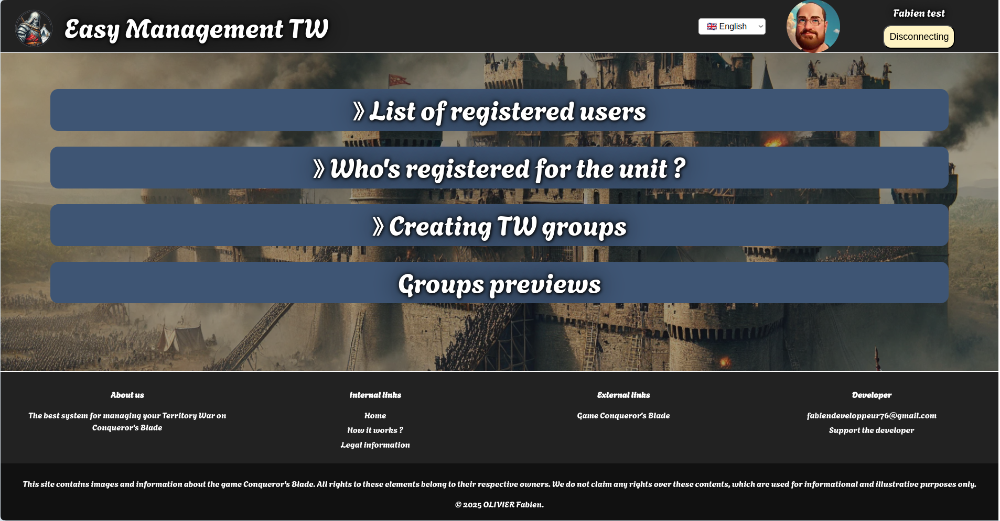
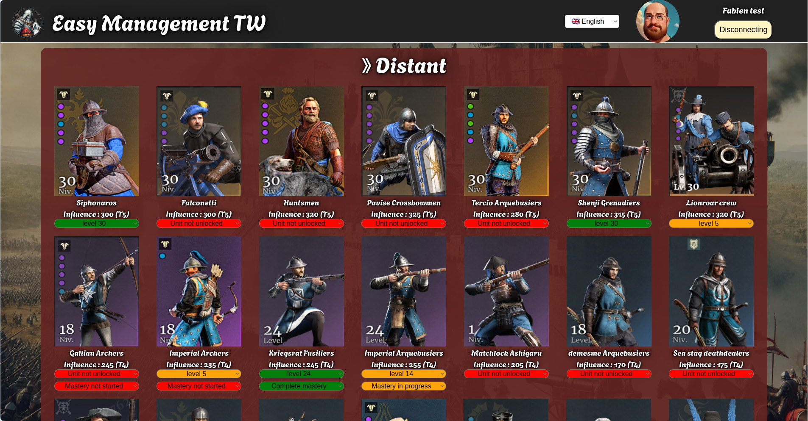
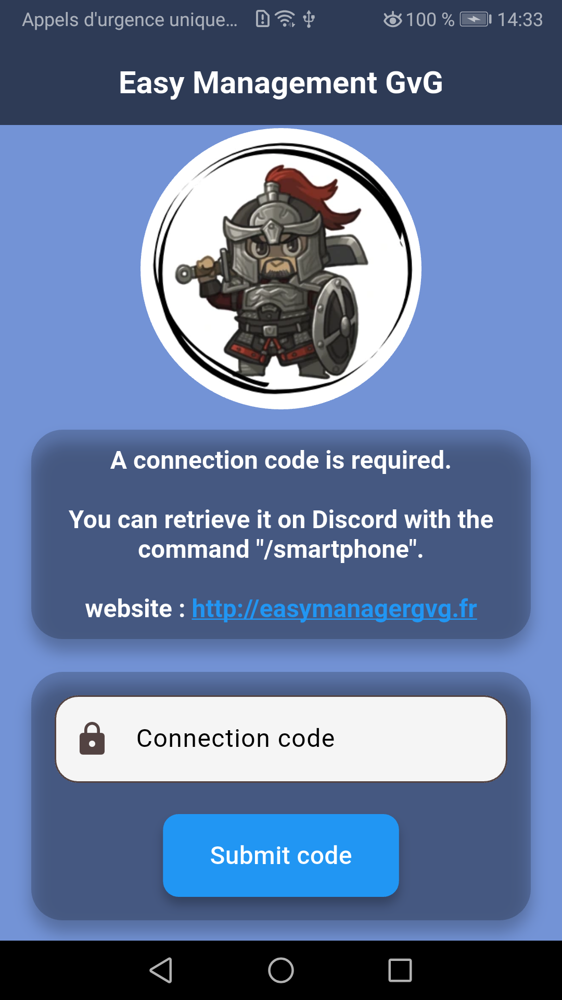

# Système de gestion des guerres de territoire multi-plateforme pour le jeu Conqueror's Blade

## 📝 Descriptif

Le projet permet de gérer de façon automatisée les inscriptions aux guerres de territoire (TW) des joueurs pour le jeu [Conqueror's Blade](https://www.conquerorsblade.com) et la préparation des batailles en créant les groupes à l'avance avec les informations nécessaires pour optimiser les groupes.
Le projet se décompose en 3 parties, un bot [Discord](https://discord.com), un site internet et une application mobile (Android), les 3 applications ont en commun une base de données SQL.

Deux langues sont prises en charge, le Français et l'Anglais.

**Accès à la plateforme**
- Le site internet est disponible à l'adresse suivante : <a href="https://easymanagementtw.fr" target="_blank">https://easymanagementtw.fr</a>
- Le bot Discord peut être inviter sur votre Discord directement depuis le site internet a l'adresse <a href="https://easymanagementtw.fr" target="_blank">https://easymanagementtw.fr</a>
- L'application mobile est en phase de test sur le Google Play store sous le nom `Easy Management TW` (en cour de déploiement)


**Partie 1 : le bot Discord** <br>
Le bot Discord permet aux utilisateurs de s'inscrire via Discord. Les informations d'inscription des joueurs sont enregistrées dans la base de données SQL, les joueurs peuvent ainsi donner la plupart des informations nécessaires à la préparation des TW.</br>
Les commandes sont enregistrées en tant que "Slash Command" Discord et sont accessibles avec une description aux utilisateurs directement sur Discord.

<table align= "center" width="95%">
    <tbody>
        <tr>
            <td></td>
            <td></td>
        </tr>
        <tr>
            <td></td>
            <td></td>
        </tr>
    </tbody>
</table>

__Les permissions utilisé par l'application Discord sont :__
| **Action**                            | **Permission Discord**         |
|--------------------------------------|--------------------------------|
| Se connecter                         | `Connect`                      |
| Envoyer des messages                 | `SendMessages`                 |
| Gérer les messages                   | `ManageMessages`               |
| Voir les anciens messages            | `ReadMessageHistory`           |
| Joindre des fichiers                 | `AttachFiles`                  |
| Intégrer des liens                   | `EmbedLinks`                   |
| Voir les logs du serveur             | `ViewAuditLog`                 |
| Utiliser les commandes de l'application | `UseApplicationCommands`     |


**Partie 2 : le site internet** <br>
Seuls les utilisateurs présents sur le Discord associé peuvent se connecter au site internet. Les rôles Discord permettent de gérer automatiquement les accès privilégiés ou non au site.
Les utilisateurs peuvent indiquer la liste des unités qu'ils ont débloquée en jeu ainsi que le niveau des unités en question. Ils peuvent également mettre à jour les informations de leur héros pour ceux qui n'apprécient pas de le faire via Discord.

Les gestionnaires de la guilde ont accès à plusieurs onglets dont ne dispose pas un simple utilisateur, ils peuvent créer les groupes TW, ils accèdent également à une page de statistique des informations contenu dans la base de données.

<table align= "center" width="95%">
    <tbody>
        <tr>
            <td></td>
            <td></td>
        </tr>
        <tr>
            <td></td>
            <td></td>
        </tr>
        <tr>
            <td colspan="2"></td>
        </tr>    
    </tbody>
</table>

**Partie 3 : l'application mobile** <br>
Seuls les utilisateurs présents sur le Discord associé peuvent récupérer un code d'application mobile avec la commande Discord `/smartphone` pour ce connecté à l'application mobile.
Les utilisateurs peuvent indiquer la liste des unités qu'ils ont débloquée en jeu ainsi que le niveau des unités en question. Ils peuvent également mettre à jour les informations de leur héros pour ceux qui n'apprécient pas de le faire via Discord.

<table align= "center" width="95%">
    <tbody>
        <tr>
            <td></td>
            <td></td>
            <td></td>
            <td></td>
        </tr> 
    </tbody>
</table>

___
## ⚙️ Installation & usage

**Avant de pouvoir exécuter le programme :**<br>
- Crée votre application Discord sur la [plateforme de développement Discord](https://discord.com/developers/applications).
- Pour votre application : générer le lien d'invitation et ajouté votre bot à votre serveur Discord.
- Pour votre application : ajouter le lien redirect de votre serveur puis générer le lien OAuth2 pour le scope `identify` et mettez-le dans la variable `LINK_DISCORD` puis modofier le `response_type=code` en `response_type=token` dans le fichier `./services/site/js/config.js`, mettez y également l'adresse de votre site internet dans la variable `adressAPI`.
- Crée le fichier (variable d'environnement) `.env` pour le bot discord, dossier `./services/bot`. Dans ce fichier, mettez le `TOKEN` de l'application Discord.
- Vous devez créer les variables globale dans les fichiers `config` pour adapter le code. Voici les emplacements des fichiers config :</br>
    - `./services/bot/config.js`
    - `./services/site/internal/config.go`
    - `./services/site/js/config.js`

**Méthode d'éxécution :** <br>
Une méthode d'éxécutions possible sur un serveur ce fais via [Screen](https://doc.ubuntu-fr.org/screen)</br>

Lors du premier lancement, le site internet doit être exécuté en premier, car c'est lui qui crée la base de donnée. Ensuite le bot discord peut être exécuté.

Pour démarrer le site internet (qui se trouve dans le dossier `./services/site`)
```sh
screen -R site_internet
sh ./launch_site.sh
# Pour detacher la console, faite `[CTRL]+[a]` suivi de `[d]`
```

Pour démarrer le bot Discord (qui se trouve dans le dossier `./services/bot`)
```sh
screen -R bot_discord
sh ./launch_bot.sh
# Pour detacher la console, faite `[CTRL]+[a]` suivi de `[d]`
```

___
## 🔗 Dépendences

**Partie 1 : le bot Discord** <br>
Le serveur utilise la version 22 de [nodeJS](https://nodejs.org/en) est les modules (dépendence) [npm](https://www.npmjs.com) version 11 suivants :<br>
- [cron](https://www.npmjs.com/package/cron)
- [date-fns](https://www.npmjs.com/package/date-fns)
- [discord.js](https://www.npmjs.com/package/discord.js)
- [dotenv](https://www.npmjs.com/package/dotenv)
- [moment-timezone](https://www.npmjs.com/package/moment-timezone)
- [sqlite](https://www.npmjs.com/package/sqlite)
- [sqlite3](https://www.npmjs.com/package/sqlite3)
- [uuid](https://www.npmjs.com/package/uuid)
- [ws](https://www.npmjs.com/package/ws)


**Partie 2 : le site internet** <br>
Le front utilise du `javascript`, `html` et `css`.<br>
Le back utilise un serveur en `go version 1.21` et les librairies suivante :
- [godotenv](https://github.com/joho/godotenv)
- [uuid](https://github.com/gofrs/uuid)
- [go-sqlite3](https://github.com/mattn/go-sqlite3)


**Partie 3 : l'application mobile** <br>
Réaliser en [Flutter](https://flutter.dev) qui utilise le language [dart](https://dart.dev) et les dépendances suivante :
- [cupertino_icons](https://pub.dev/packages/cupertino_icons)
- [http](https://pub.dev/packages/http)
- [path_provider](https://pub.dev/packages/path_provider)
- [flutter_local_notifications](https://pub.dev/packages/flutter_local_notifications)
- [internet_connection_checker_plus](https://pub.dev/packages/internet_connection_checker_plus)
- [url_launcher](https://pub.dev/packages/url_launcher)

___
## 🧑‍💻 Authors

+ Fabien OLIVIER
