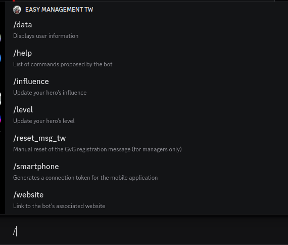
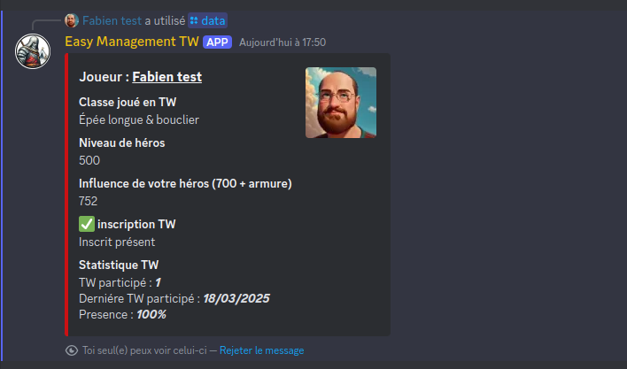
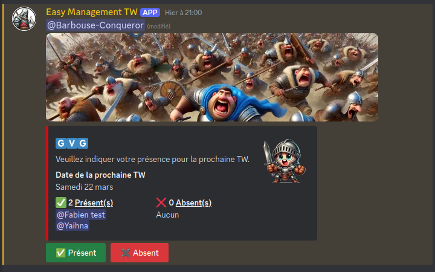
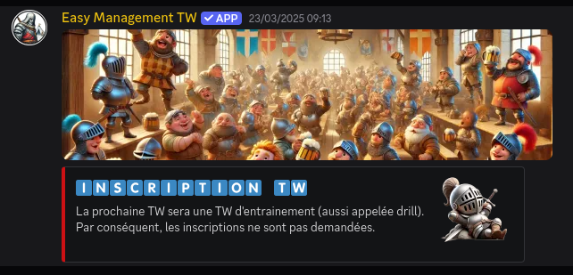
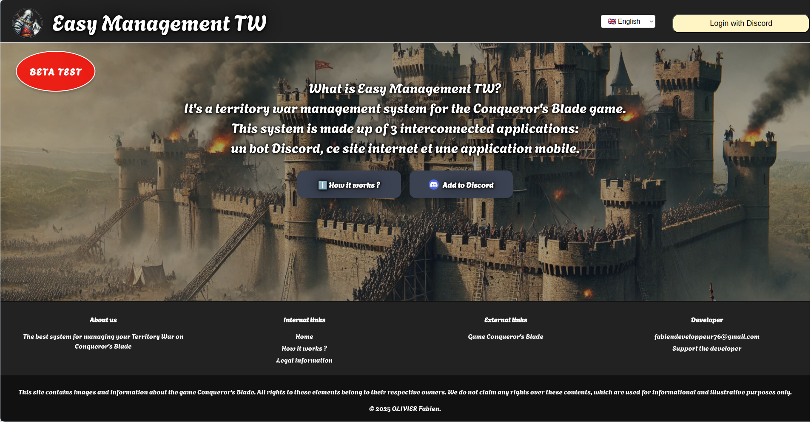
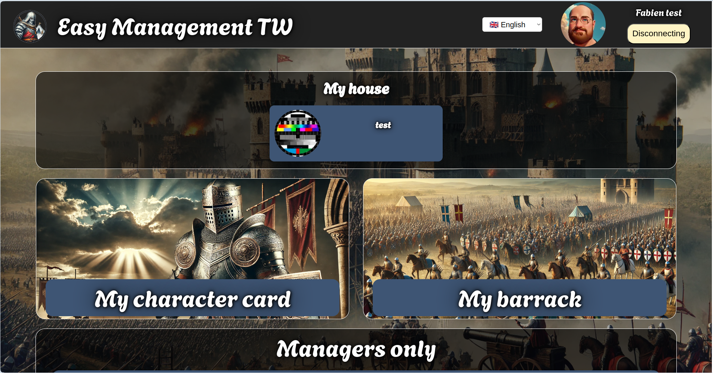
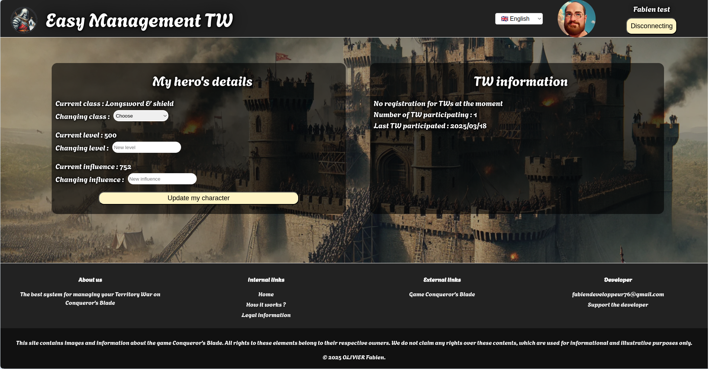
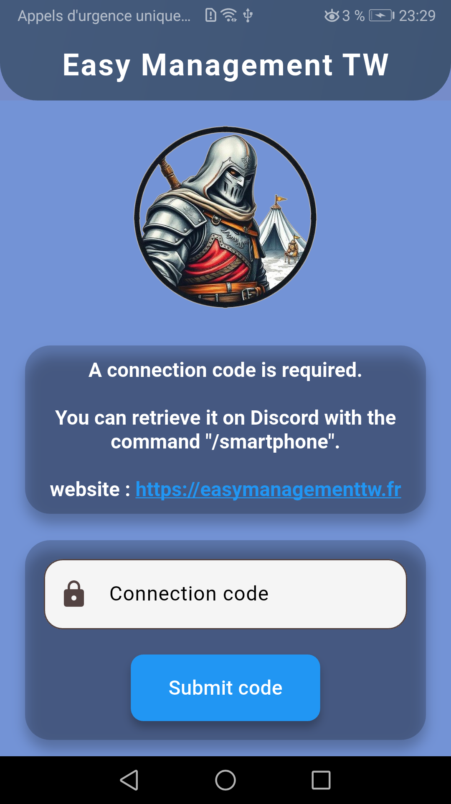

# Système de gestion des guerres de territoire multi-plateforme pour le jeu Conqueror's Blade

## 📝 Descriptif

Le projet permet de gérer de façon automatisée les inscriptions aux guerres de territoire (TW) des joueurs pour le jeu [Conqueror's Blade](https://www.conquerorsblade.com) et la préparation des batailles en créant les groupes à l'avance avec les informations nécessaires pour optimiser les groupes.</br>
Le projet se décompose en 3 parties, un bot [Discord](https://discord.com), un site internet et une application multi-plateforme (Android, IOS et Destop), les 3 applications ont en commun une base de données SQL.

Deux langues sont prises en charge, le Français et l'Anglais.

**Accès à la plateforme**
- Le site internet est disponible à l'adresse suivante : <a href="https://easymanagementtw.fr" target="_blank">https://easymanagementtw.fr</a>
- Le bot Discord peut être inviter sur votre Discord directement depuis le site internet a l'adresse <a href="https://easymanagementtw.fr" target="_blank">https://easymanagementtw.fr</a>
- L'application mobile est en phase de test sur le Google Play store sous le nom `Easy Management TW` (en cour de déploiement)


**Partie 1 : le bot Discord** <br>
Le bot Discord permet aux utilisateurs de s'inscrire via Discord. Les informations d'inscription des joueurs sont enregistrées dans la base de données SQL, les joueurs peuvent ainsi donner la plupart des informations nécessaires à la préparation des TW.</br>
Les commandes sont enregistrées en tant que "Slash Command" Discord et sont accessibles avec une description aux utilisateurs directement sur Discord.

<table align= "center" width="95%">
    <tbody>
        <tr>
            <td></td>
            <td></td>
        </tr>
        <tr>
            <td></td>
            <td></td>
        </tr>
    </tbody>
</table>

__Les permissions utilisé par l'application Discord sont :__
| **Action**                            | **Permission Discord**         |
|--------------------------------------|--------------------------------|
| Se connecter                         | `Connect`                      |
| Envoyer des messages                 | `SendMessages`                 |
| Gérer les messages                   | `ManageMessages`               |
| Voir les anciens messages            | `ReadMessageHistory`           |
| Joindre des fichiers                 | `AttachFiles`                  |
| Intégrer des liens                   | `EmbedLinks`                   |
| Voir les logs du serveur             | `ViewAuditLog`                 |
| Utiliser les commandes de l'application | `UseApplicationCommands`     |


**Partie 2 : le site internet** <br>
Seuls les utilisateurs présents sur le Discord associé peuvent se connecter au site internet. Les rôles Discord permettent de gérer automatiquement les accès privilégiés ou non au site.
Les utilisateurs peuvent indiquer la liste des unités qu'ils ont débloquée en jeu ainsi que le niveau des unités en question. Ils peuvent également mettre à jour les informations de leur héros pour ceux qui n'apprécient pas de le faire via Discord.

Les gestionnaires de la guilde ont accès à plusieurs onglets dont ne dispose pas un simple utilisateur, ils peuvent créer les groupes TW, ils accèdent également à une page de statistique des informations contenu dans la base de données.

<table align= "center" width="95%">
    <tbody>
        <tr>
            <td></td>
            <td></td>
        </tr>
        <tr>
            <td></td>
            <td></td>
        </tr>
        <tr>
            <td colspan="2"></td>
        </tr>    
    </tbody>
</table>

**Partie 3 : l'application multi-plateforme** <br>
Seuls les utilisateurs présents sur le Discord associé peuvent récupérer un code d'application multi-plateforme avec la commande Discord `/smartphone` pour ce connecté à l'application multi-plateforme.
Les utilisateurs peuvent indiquer la liste des unités qu'ils ont débloquée en jeu ainsi que le niveau des unités en question. Ils peuvent également mettre à jour les informations de leur héros pour ceux qui n'apprécient pas de le faire via Discord.

<table align= "center" width="95%">
    <tbody>
        <tr>
            <td></td>
            <td></td>
            <td></td>
            <td></td>
        </tr> 
    </tbody>
</table>

___
## ⚙️ Installation & usage

**Avant de pouvoir exécuter le programme :**<br>
Crée votre application Discord sur la [plateforme de développement Discord](https://discord.com/developers/applications) et aprés avoir crée le bot Discord, effectué les actions suivantes :
  - Générer le lien d'invitation Discord et inscrivez le dans le fichier `./services/site/src/js/config.js`.
  - Ajouter le lien de redirection de votre serveur puis générer le lien OAuth2 pour le scope `identify` et mettez-le dans le fichier `./services/site/src/js/config.js` en modifiant le `response_type=code` en `response_type=token`.


Créer est complété les 4 fichiers de configurations suivant :</br>
```js
// Fichier `./services/bot/env`
TOKEN = "<TOKEN DU BOT DISCORD>"
ID_APP = "<ID DE L'APPLICATION DU BOT DISCORD>"
```

```js
// Fichier `./services/bot/config.js`
export const adressdb = "../database/databaseGvG.db";
export const siteInternet = "<NOM DE DOMAINE OU IP DU SITE INTERNET>";
export const store_app_android = "<ADRESSE DE L'APPLICATION SUR LE GOOGLE PLAY STORE>";
export const store_app_ios = "<ADRESSE DE L'APPLICATION SUR L'APPLE STORE>";
export const ListAdmin = ["<VOS ID DISCORD>"];
export const listUserBan = ["<LES ID DISCORD>"];

// Configuration des paramétres du Discord développeur
export const discordTest_id = "<ID SERVER DISCORD>";
export const discordTest_groupAdminForum = "<ID GROUPE DISCORD>";
export const discordTest_chanForum = "<ID CHAN DISCORD POUR LES NOTIFICATIONS DU FORUM>";
export const discordTest_chanDM = "<ID CHAN DISCORD POUR LES MESSAGES PRIVEE>";
```
```go
// Fichier `./services/site/internal/config.go`
const PORT = "8080"
const SITE_DOMAIN = "localhost"
const ADRESS_DB = "../database/databaseGvG.db"
const OWNER = "179655652153491456"
```

```js
// Fichier `./services/site/src/js/config.js`
export const cookieName = "user_token";
export const domain = "<NOM DE DOMAINE OU ADRESSE IP DU SITE>";
export const LINK_INVITE_BOT = "<LIEN GENERE SUR LA PLATEFORME DE DEVELOPPEMENT DISCORD>";
export const LINK_DISCORD = "<LIEN GENERE SUR LA PLATEFORME DE DEVELOPPEMENT DISCORD>"
export const adressAPI = "http://<VOTRE ADRESSE>/api/";
```

**Méthode d'éxécution :** <br>
Une méthode d'éxécutions possible sur un serveur ce fais via [Screen](https://doc.ubuntu-fr.org/screen)</br>

Lors du premier lancement, le site internet doit être exécuté en premier, car c'est lui qui crée la base de donnée. Ensuite le bot discord peut être exécuté.

Pour démarrer le site internet (qui se trouve dans le dossier `./services/site`)
```sh
screen -R site_internet
sh ./launch_site.sh
# Pour detacher la console, faite `[CTRL]+[a]` suivi de `[d]`
```

Pour démarrer le bot Discord (qui se trouve dans le dossier `./services/bot`)
```sh
screen -R bot_discord
sh ./launch_bot.sh
# Pour detacher la console, faite `[CTRL]+[a]` suivi de `[d]`
```

___
## 🔗 Dépendences

**Partie 1 : le bot Discord** <br>
Le serveur utilise la version 22 de [nodeJS](https://nodejs.org/en) est les modules (dépendence) [npm](https://www.npmjs.com) version 11 suivants :<br>
- [cron](https://www.npmjs.com/package/cron)
- [date-fns](https://www.npmjs.com/package/date-fns)
- [discord.js](https://www.npmjs.com/package/discord.js)
- [dotenv](https://www.npmjs.com/package/dotenv)
- [moment-timezone](https://www.npmjs.com/package/moment-timezone)
- [sqlite](https://www.npmjs.com/package/sqlite)
- [sqlite3](https://www.npmjs.com/package/sqlite3)
- [uuid](https://www.npmjs.com/package/uuid)
- [ws](https://www.npmjs.com/package/ws)


**Partie 2 : le site internet** <br>
Le front utilise du `javascript`, `html` et `css`.<br>
Le back utilise un serveur en `go version 1.21` et les librairies suivante :
- [godotenv](https://github.com/joho/godotenv)
- [uuid](https://github.com/gofrs/uuid)
- [go-sqlite3](https://github.com/mattn/go-sqlite3)

Une dépense NodeJS est utilisé par le back
- [javascript-obfuscator](https://www.npmjs.com/package/javascript-obfuscator)


**Partie 3 : l'application multi-plateforme** <br>
Réaliser en [Flutter](https://flutter.dev) qui utilise le language [dart](https://dart.dev) et les dépendances suivante :
- [cupertino_icons](https://pub.dev/packages/cupertino_icons)
- [http](https://pub.dev/packages/http)
- [path_provider](https://pub.dev/packages/path_provider)
- [flutter_local_notifications](https://pub.dev/packages/flutter_local_notifications)
- [internet_connection_checker_plus](https://pub.dev/packages/internet_connection_checker_plus)
- [url_launcher](https://pub.dev/packages/url_launcher)

___
## 🧑‍💻 Authors

+ Fabien OLIVIER
